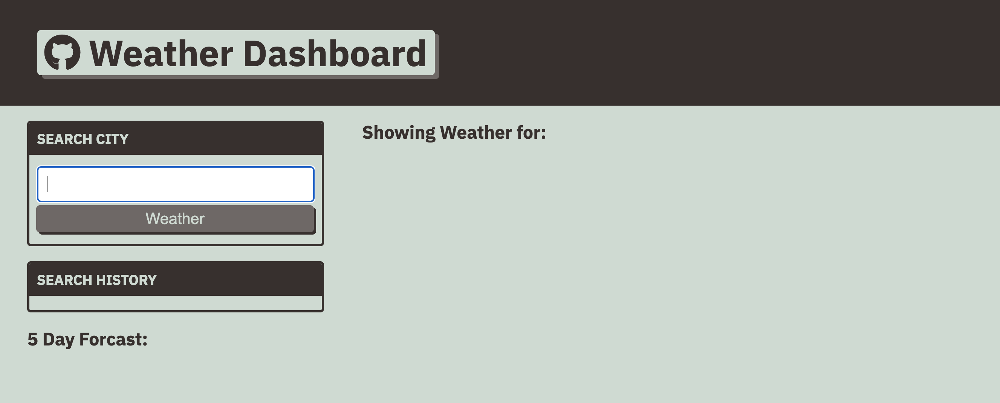
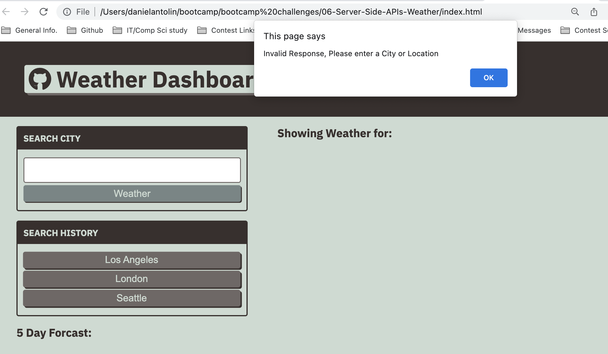
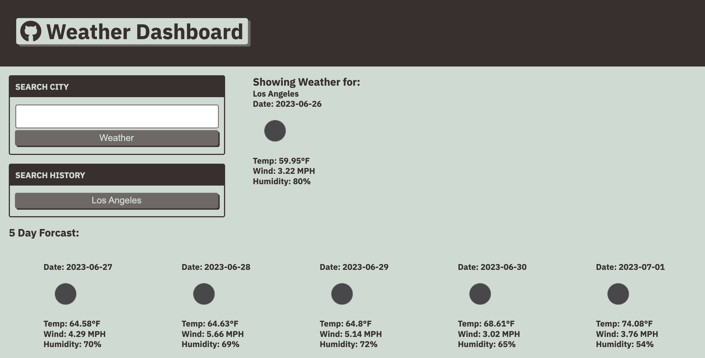
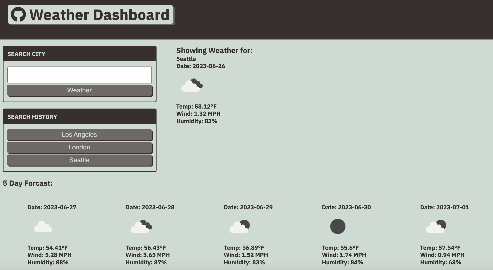
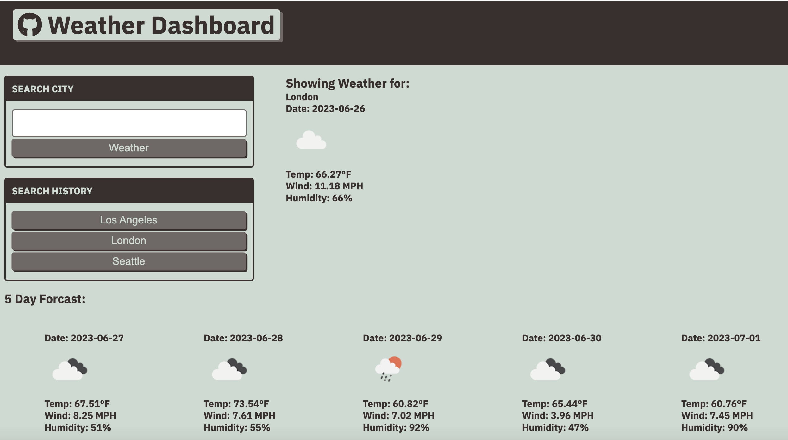
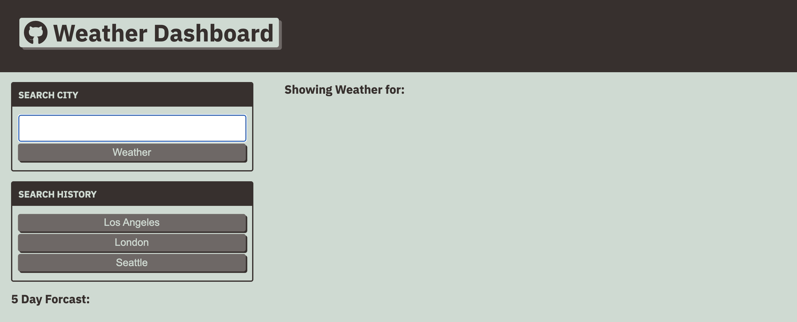

# 06-Server-Side-APIs-Weather
## Description

The project is to build a webpage that checks a weather API and gives out the weather and 5 day forcast of a desired city. It also saves ypour search history so you can look at the current weather of previous searched cities.

## Installation
To start enter a city in the textbox.
 

Please not the site will give an alert on bad input.
 

Afterwards it will display the weather.
 

Once you keep entering a few cities, it will save them into your local page as shown here.
 

Once you have a search history, you can retrieve weather by clicking one of the search history.

 

If you reload, your search history remains. Keep note that it will cotinue to increase the list and will not remopve items.

 

### NOTE:Due to an issue with openweathermap api sending data back being not secured it blocks the page from running properly. To run it, the site needs to allow insecure content to run it as intended.

## Usage

You can use this code to look at the weather forcaset and keeps a history of your searches. 

## Credits
For this challenge assignment, I used code from week 6 Section 24 Stu_Review-Part-Two of Server Side API section. It was used to set up CSS, event listeners, HTML query selectors and a general outline on running fetch on the weather API.
